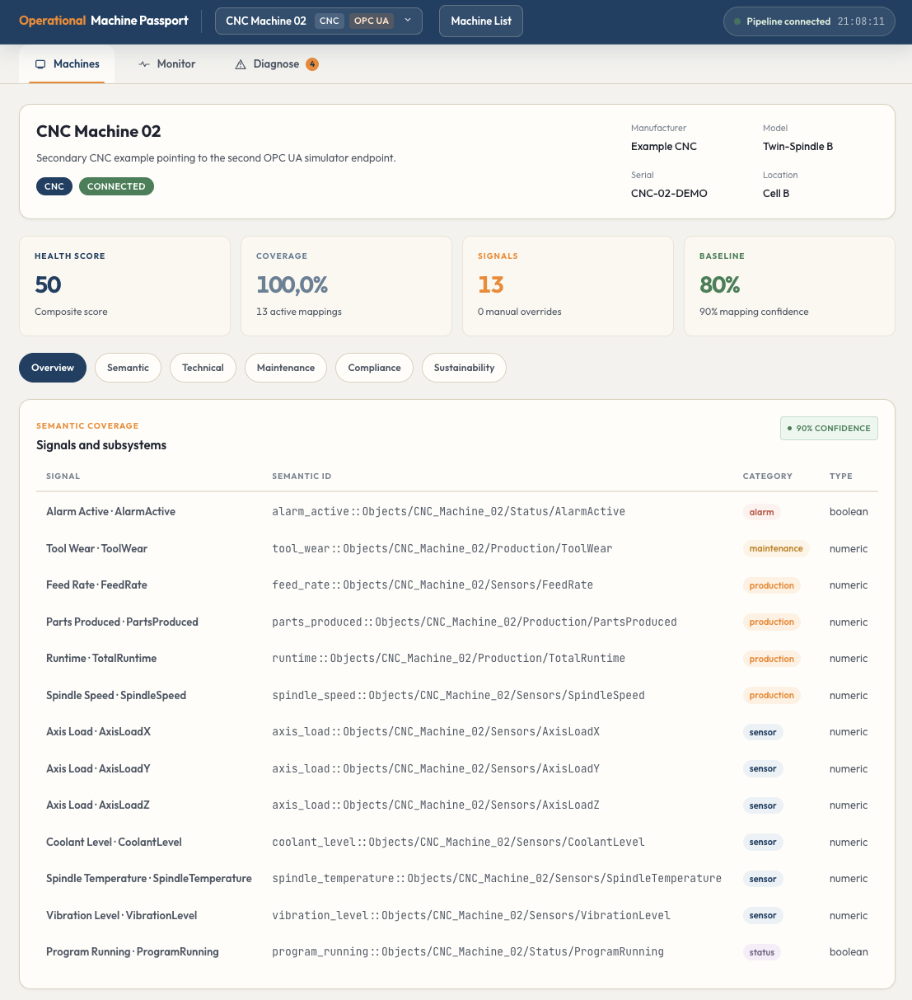
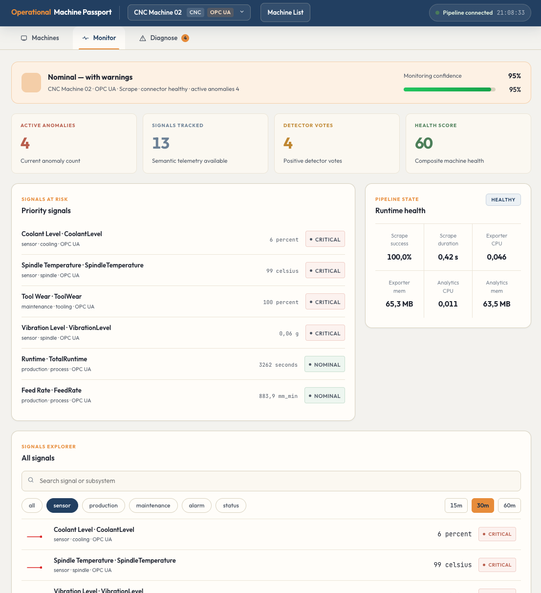
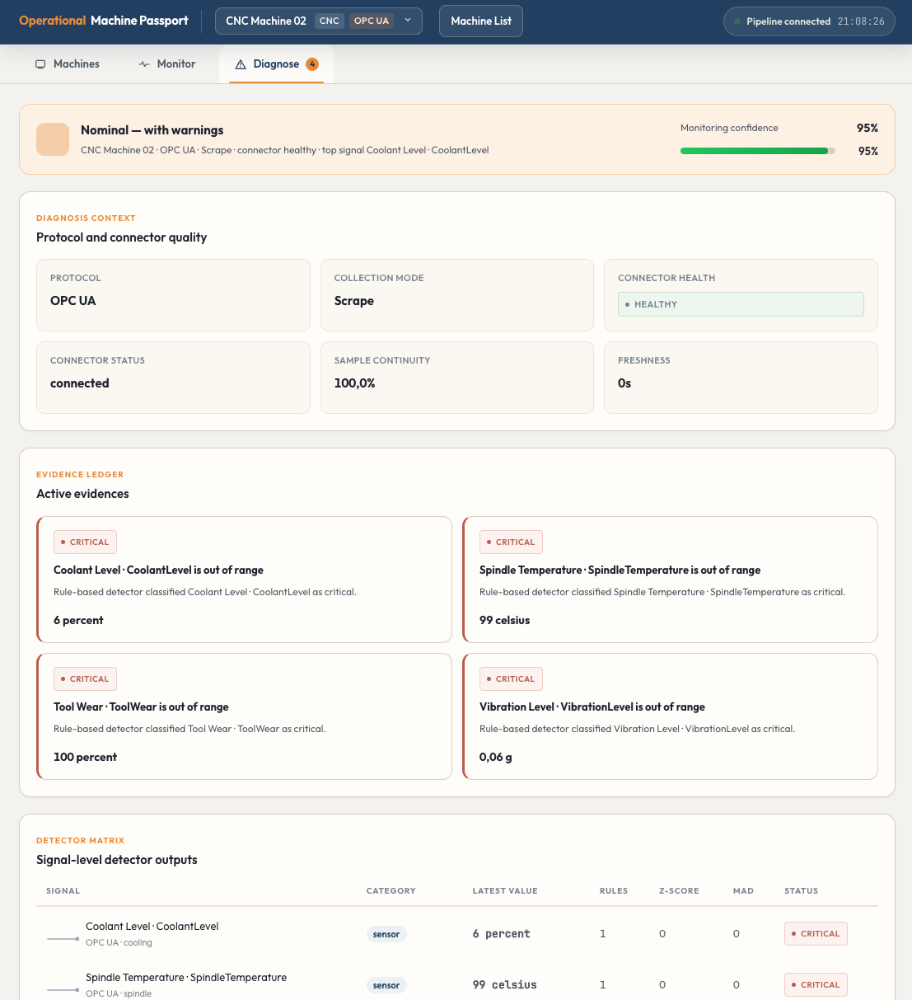

# Machine Passport

A multi-protocol platform for industrial observability and operational machine passports. Registers heterogeneous assets, ingests telemetry over **OPC UA** and **MQTT**, normalizes signals to a common semantic model, detects anomalies, and maintains a living digital passport per machine.

## What it does

- **Machine registry** — register assets, test connectivity, run signal discovery
- **Semantic normalization** — map raw OPC UA nodes and MQTT topics to a shared model
- **Live monitoring** — track anomalies, risky signals and pipeline health
- **Anomaly diagnosis** — rule-based, z-score and MAD detectors with cross-layer IT/OT correlation
- **Machine passport** — persistent per-asset record covering identity, connectivity, semantics, baseline, maintenance, compliance and more

## Architecture

| Service | Description |
|---|---|
| `apps/analytics` | Anomaly detection, passport builder and REST API |
| `apps/industrial-exporter` | Multi-protocol ingestion with semantic mapping profiles |
| `apps/ui` | React frontend (Machines, Monitor, Diagnose) |
| `simulators/opcua` | OPC UA CNC simulator with reproducible scenarios |
| `simulators/mqtt` | MQTT CNC simulator with ground truth generation |
| `infra/` | Prometheus, Grafana, Caddy reverse proxy, Mosquitto broker |

## Quick start

```bash
git clone https://github.com/CIGIP-UPV/Operational-Machine-Passport.git
cd Operational-Machine-Passport
docker compose up -d --build
```

## Endpoints

| Service | URL |
|---|---|
| UI | http://localhost:4000 |
| Grafana | http://localhost:3000 |
| Prometheus | http://localhost:9093 |
| OPC UA CNC 1 | `opc.tcp://localhost:4840/freeopcua/assets/` |
| OPC UA CNC 2 | `opc.tcp://localhost:4841/freeopcua/assets/` |
| MQTT broker | `mqtt://localhost:1884` |

Default credentials for protected endpoints: `admin` / `admin`.

## Screenshots

<p align="center">
  
  
  
</p>

## License

See [LICENSE](LICENSE) for details.
